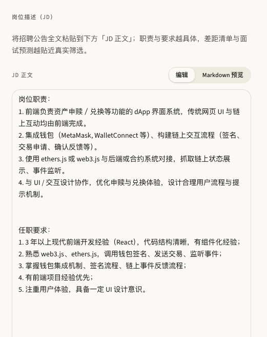
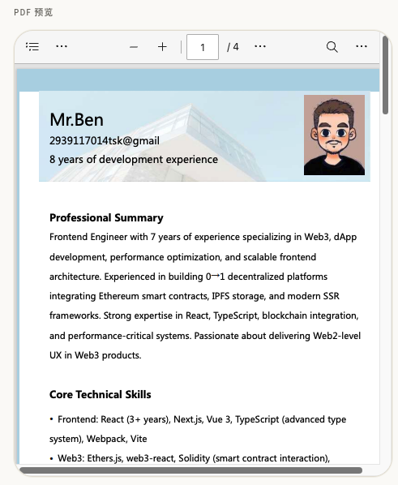
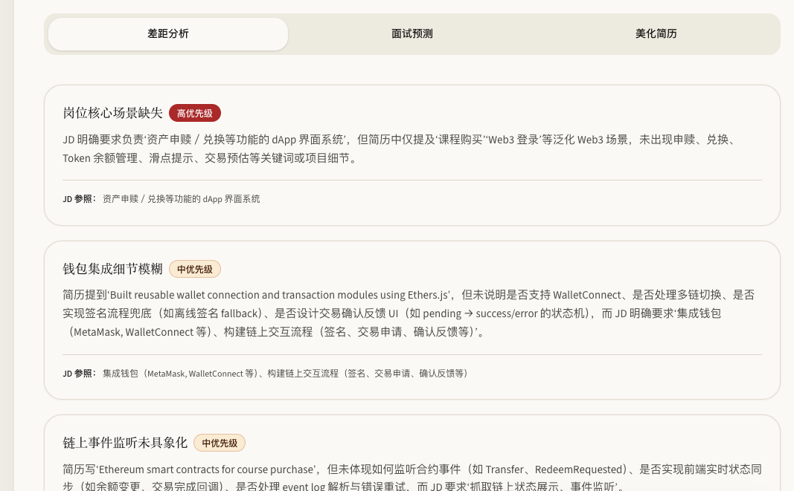
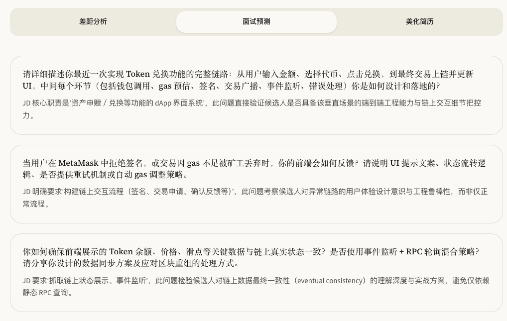
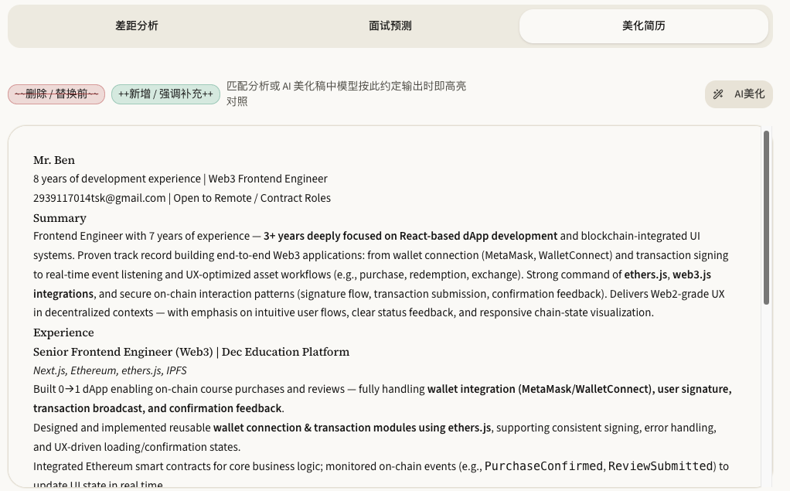

# Resume Matcher

面向求职场景的 **简历 × 岗位描述（JD）** 对齐工具：上传 PDF/DOCX、粘贴目标岗位全文，一键得到 **差距分析**、**面试题预测** 与 **结合 JD 的简历美化稿**，并在本地保存草稿（无需登录）。

---

## 功能一览

| 能力 | 说明 |
|------|------|
| **JD 录入** | 支持长文粘贴；可切换「编辑 / Markdown 预览」，职责与要求越具体，分析越贴近真实筛选。 |
| **简历上传与预览** | 支持 **PDF**（浏览器内预览）、**DOCX**（前端抽取正文预览）；分析时由服务端再次解析正文。 |
| **匹配分析** | 结合 JD 与简历全文，输出摘要、分级差距项、面试方向；改写稿可带修订标记便于对照。 |
| **差距分析** | 每条含标题、说明、优先级（高/中/低），并附 **JD 参照** 片段，便于逐条补强。 |
| **面试预测** | 按 JD 生成高概率技术/业务问题，并解释「为何会问」，便于针对性准备。 |
| **美化简历** | 单独调用润色接口，**必须携带当前 JD**，结构与关键词向岗位对齐；可保留已有分析结果，仅更新预览稿。 |
| **修订对照** | 模型可使用 `~~删除/替换前~~` 与 `++新增/补充++` 语法，前端以 **红删绿增** 高亮（详见前端 README）。 |
| **本机草稿** | JD、分析结果写入 `localStorage`；限额内简历可写入 IndexedDB，下次打开可恢复。 |

---

## 岗位描述（JD）

将招聘公告全文粘贴到 **JD 正文**；界面提示会说明：职责与要求越具体，**差距清单**与**面试预测**越贴近真实筛选。支持 **Markdown 预览** 检查排版。



---

## 简历上传与 PDF 预览

上传 **PDF** 或 **DOCX** 后，可在页面内直接预览（PDF 使用浏览器内置查看器；复杂 DOCX 排版可能与 Word 略有差异）。点击 **运行匹配分析** 后，由后端抽取正文并调用大模型。



---

## 差距分析

分析完成后，在 **差距分析** 标签查看结构化结果：每条风险点包含 **优先级标签**、详细说明，以及对应的 **JD 参照**，方便你对照招聘原文逐项修改简历。



---

## 面试预测

切换到 **面试预测**，查看根据当前 JD 推导的 **面试问题** 与 **出题动机**，用于模拟面试与知识查漏补缺。



---

## 美化简历

在 **美化简历** 中查看 Markdown 渲染后的简历稿；图例说明 **删除/替换** 与 **新增/强调** 的显示约定。可随时点击 **AI 美化**（需已填写 JD）单独刷新润色稿；若已做过完整匹配分析，一般会保留差距与面试结果，仅更新下方预览内容。



---

## 快速开始

- **前端**（Vue 3 + Vite）：见 [`front/README.md`](./front/README.md)  
- **后端**（NestJS，`/resume/analyze` 与 `/resume/polish`）：见 [`backend/README.md`](./backend/README.md)  

典型本地联调：后端 `pnpm run start:dev`（默认 `3001`），前端配置 `VITE_API_BASE_URL` 指向该地址；未配置时前端使用模拟数据演示流程。

---

## 仓库结构（简要）

```
resume-matcher/
├── front/          # 单页应用
├── backend/        # Nest API
├── pic1.png … pic5.png   # 界面截图（本文档）
└── README.md       # 本说明（偏产品功能）
```
